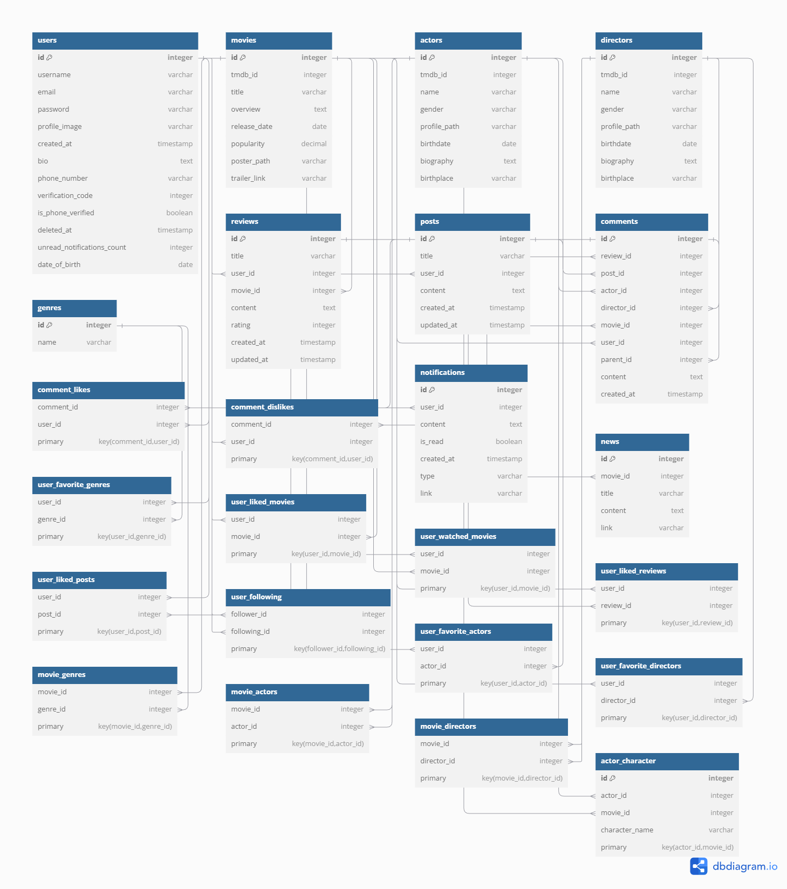
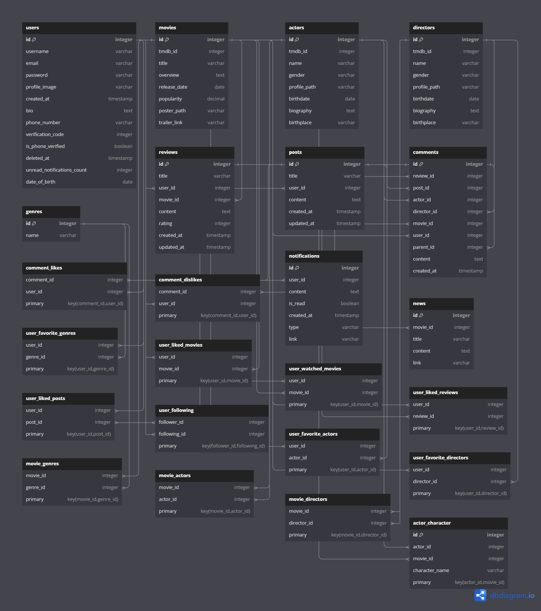
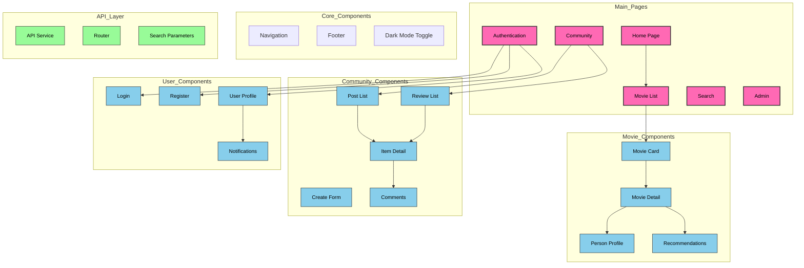

# 🎬 MovieRec 프로젝트 개요

MovieRec은 영화 추천과 커뮤니티 기능을 결합한 SPA 플랫폼입니다.  
TMDB API를 활용하여 사용자에게 맞춤형 영화 추천을 제공하며, 영화 팬들이 자유롭게 소통할 수 있는 공간을 제공합니다.
※ .env 파일을 생성하세요

---

## **프로젝트 목적**

1. 사용자 선호도를 분석하여 **정확한 영화 추천** 제공.
2. 활발한 리뷰 작성 및 댓글 활동을 통한 **커뮤니티 활성화**.
3. 직관적이고 반응형인 **친화적인 UX/UI** 설계.

---

## **주요 기능**

- **영화 추천**: 사용자 맞춤형 추천 및 인기 영화 제공.
- **검색 및 필터링**: 제목, 배우, 감독 검색 및 다중 필터 제공.
- **커뮤니티**: 리뷰 작성, 댓글 및 좋아요, 알림 기능 등 강력한 커뮤니티.
- **프로필 시스템**: 선호 영화/장르 및 활동 통계 제공.
- **배우/감독 정보**: 상세 프로필 및 필모그래피 제공.
- **영화 관련 정보**: 각 영화에 대한 뉴스 및 트레일러 제공.

---

## 📂 상세 문서

- **API 문서**: [API_DOCUMENTATION.md](./docs/API_DOCUMENTATION.md)

## **기술 스택 및 도구**

- **Frontend**: Next.js, Tailwind CSS, TypeScript with JSX
- **Backend**: Django, Django REST Framework
- **Database**: SQLite
- **외부 API**: TMDB API, YouTube API, Naver 검색 API
- **생성형 AI**: ChatGPT 4.0, Vercel v0
- **협업 도구**: Notion, Mattermost
- **기타**: Axios 비동기 HTTP 요청 처리

---

# 🚀 개발 과정

## **개발 기간**

- **2024년 11월 18일 ~ 2024년 11월 26일** (총 9일)

---

## **아이디어 발상**

- **프로젝트 동기**:  
  영화 추천 서비스와 커뮤니티 플랫폼이 각각 따로 존재하는 점에서 착안하여,  
  **사용자 맞춤형 추천**과 **활발한 소통 공간**을 결합한 **MovieRec**을 기획.

- **해결하고자 하는 문제**:
  1. **사용자 취향 반영 부족**: 기존 영화 추천 서비스는 사용자 데이터를 효과적으로 활용하지 못함.
  2. **커뮤니티의 분산화**: 영화 관련 커뮤니티가 흩어져 있어 통합된 공간이 필요함.

---

## **설계**

### **데이터베이스 설계**

- 사용자, 영화, 배우, 감독, 장르 간의 관계를 명확히 정의.
- **ERD**를 기반으로 모델 설계 완료.
- ERD 이미지 참고:
  - 
  - 


### **프론트엔드 컴포넌트 구조**
프로젝트의 프론트엔드 컴포넌트와 페이지 간의 관계를 나타낸 다이어그램입니다.



### **주요 설계 포인트**

1. **사용자 중심 데이터 모델**
   - **사용자 활동 통계**: 좋아요, 리뷰, 댓글 등 기록.
   - **팔로우 기능**: 사용자 간 상호작용 지원.
2. **영화 추천 로직 설계**
   - TMDB API의 인기 데이터와 사용자 선호 장르 결합.
   - 사용자 정보 기반 개인화 추천 시스템 구현.
3. **확장성을 고려한 설계**
   - 각 엔티티 간 **Many-to-Many 관계** 활용.
   - API 확장을 고려하여 직관적인 데이터 흐름 설계.

---

## **개발 일정**

| 날짜           | 진행 사항                             |
|----------------|----------------------------------|
| **2024-11-18** | 프로젝트 구조 설계 및 초기 세팅 완료 |
| **2024-11-19** | 데이터베이스 설계 및 ERD 모델 정의   |
| **2024-11-20** | 사용자 인증 및 기본 CRUD 기능 구현   |
| **2024-11-21** | 영화 및 배우/감독 데이터 수집 및 저장 |
| **2024-11-22** | 추천 알고리즘 및 영화 검색 기능 구현 |
| **2024-11-23** | 커뮤니티 기능(리뷰, 댓글) 개발       |
| **2024-11-24** | UI 디자인 및 Tailwind CSS 적용     |
| **2024-11-25** | 최종 테스트 및 성능 최적화           |
| **2024-11-26** | 최종 디버깅 및 문서화 완료          |

---

## **역할 분담**

- **팀원 안혜성**
  - **커뮤니티 기능 개발**: 리뷰 및 댓글 시스템 구현, 알림 기능 개발.
  - **모델 및 추천 알고리즘 설계**: 데이터베이스 모델링, 사용자 기반 추천 로직 구현.
  - **퓰스택 개발**: 
    - Django REST Framework를 활용한 API 개발.
    - Next.js와 TypeScript를 활용한 사용자 인터페이스 구현.
- **팀원 원기훈**
  - **영화 정보 기능 개발**: TMDB API를 활용한 영화 데이터 수집 및 처리.
  - **UI 디자인 설계 및 구현**: Tailwind CSS를 활용한 반응형 UI 설계 및 구현.
  - **퓰스택 개발**: 
    - Django REST Framework를 활용한 API 개발.
    - Next.js와 TypeScript를 활용한 사용자 인터페이스 구현.

---

## **사용된 도구**

- **ERD 설계**: DBdiagram.io
- **API 설계 및 테스트**: Swagger
- **협업 도구**: Notion, Mattermost

---

# 🎯 주요 기능 상세: 추천 알고리즘 및 커뮤니티 기능

## 🚀 1️⃣ 추천 알고리즘

### **(1) 사용자 정보 기반 추천**

사용자 활동과 선호도를 분석하여 개인화된 영화 추천 리스트를 제공합니다.

#### **추천 로직**

1. **장르 기반 추천**
   - 사용자가 선호하는 장르와 영화 장르의 **유사도 계산**.
   - 사용자 데이터(`favorite_genres`)와 영화 데이터(`genres`) 간의 교집합 비율을 활용.
   - 관련 함수: `calculate_genre_similarity`

2. **좋아요한 영화 기반 추천**
   - 사용자가 좋아요를 누른 영화의 장르와 현재 영화의 **유사성 점수 계산**.
   - 관련 함수: `calculate_liked_movies_similarity`

3. **배우/감독 선호도 기반 추천**
   - 사용자가 즐겨찾기한 배우/감독이 포함된 영화인지 확인하고 점수 계산.
   - 관련 함수: `calculate_actor_similarity`, `calculate_director_similarity`

4. **친구 활동 기반 추천**
   - 사용자가 팔로우한 친구들이 좋아요한 영화와의 연관성을 분석.
   - 관련 함수: `calculate_friend_activity`

5. **가중치 기반 점수 합산**
   - 각 추천 요소에 대해 가중치를 부여하여 최종 점수를 계산:
     ```python
     total_score = (
         0.3 * genre_score +
         0.2 * liked_movie_score +
         0.2 * actor_score +
         0.2 * director_score +
         0.1 * friend_score
     )
     ```
   - 점수 기준으로 상위 10개 영화를 반환.

---

### **(2) 키워드 기반 추천**

사용자가 입력한 키워드를 기반으로 관련된 영화를 추천합니다.

#### **추천 로직**

1. **영화 데이터 임베딩**
   - 영화 제목(`title`)과 줄거리(`overview`)를 문장 임베딩하여 벡터화.
   - **전역 캐싱**을 통해 불필요한 계산 방지.
   - 관련 함수: `get_movie_embeddings`

2. **코사인 유사도 계산**
   - 사용자가 입력한 키워드와 영화 데이터 임베딩 간의 코사인 유사도 계산.
   - **가중치 적용**:
     ```python
     total_score = 0.6 * title_similarities[i] + 0.4 * overview_similarities[i]
     ```

3. **추천 리스트 생성**
   - 유사도 점수 기준으로 상위 10개 영화를 반환.

---

### **(3) 연속성 및 사용자 경험 강화**

- **모달 중첩 지원**
  - 모달 창을 무한히 중첩시킬 수 있는 구조로, 영화, 감독, 배우 간 빠른 탐색을 지원.
- **영화/감독/배우 카드 기능 강화**
  - 댓글 작성, 관련 뉴스 및 트레일러 확인, 세부 정보 탐색 탭 제공.
- **유저 프로필 커스터마이징**
  - 해당 사용자가 좋아하는 영화, 팔로우 관계, 활동 내역 등을 시각적으로 제공.

---

## 💬 2️⃣ 커뮤니티 기능

### **(1) 알림 시스템**

- **구현 세부사항**
  - 사용자가 팔로우한 사람의 신규 게시물, 댓글, 좋아요, 팔로우 요청 등에 대한 실시간 알림 제공.
  - Django Signals와 `notifications` 모델을 활용하여 이벤트 기반 알림 처리.

### **(2) 댓글과 대댓글**

- 리뷰 및 게시글에 댓글 작성 가능.
- 대댓글은 트리 구조(`parent_id`)를 사용하여 계층적으로 관리.

### **(3) 다크 모드 지원**

- **커뮤니티 페이지**에 한정하여 다크 모드 토글 기능 제공.
- 사용자 선호도에 따라 UI를 커스터마이징 가능.

---

## 🌟 구현 결과

- **사용자 중심의 개인화 경험**
  - 추천 시스템과 커뮤니티 기능이 결합되어 사용자가 더욱 몰입할 수 있는 환경 제공.
- **덕질 최적화**
  - 영화, 감독, 배우 간 상호 참조와 모달 탐색으로 덕후들에게 최적화된 플랫폼.
- **활발한 커뮤니티**
  - 알림과 다크 모드 등으로 사용자 경험을 강화하며 커뮤니티 활성화.

---

# 🚧 문제 해결 사례

## 1️⃣ 모달 뒤로가기 및 중첩 구현

### **문제**

- 모달을 중첩시키는 기능을 구현할 때, **뒤로가기 버튼**을 누르면 적절히 이전 상태로 돌아가지 않는 문제가 발생.
- 모달이 여러 개 중첩될 경우 관리가 복잡해지는 상황.

### **해결 과정**

1. **상태 관리**
   - 모달의 상태를 `stack` 구조로 관리하여, 뒤로가기 시 가장 최근 모달만 제거.
2. **라우팅 연동**
   - Next.js의 `router.push`와 `router.back`을 활용해 상태와 URL을 동기화.
3. **테스트**
   - 다양한 중첩 시나리오를 테스트하며 에러 상황을 확인하고 수정.

### **결과**

- 모달 중첩 및 뒤로가기가 안정적으로 작동하며, 사용자 경험(UX)이 대폭 향상.

---

## 2️⃣ 대댓글 구현

### **문제**

- 대댓글 구조를 설계할 때, 트리 구조로 관리해야 하는 복잡성 발생.
- 대댓글이 많아질 경우 데이터 로드 및 렌더링 속도 저하.

### **해결 과정**

1. **데이터베이스 설계**
   - `parent_id` 필드를 활용해 트리 구조를 구성.
   - 대댓글이 없는 경우 `parent_id`는 `null`.
2. **프론트엔드 최적화**
   - 대댓글을 필요 시점에만 로드하는 **Lazy Loading** 구현.
3. **성능 테스트**
   - 대규모 댓글 데이터를 생성해 성능 테스트 진행.

### **결과**

- 대댓글 트리 구조가 안정적으로 작동하며, 로딩 속도가 크게 개선됨.

---

## 3️⃣ 다크 모드 도입 시 기획의 중요성 깨달음

### **문제**

- 다크 모드를 도입하면서 각 페이지의 스타일링과 사용자 경험(UX)을 통일하는 데 어려움 발생.
- 특히 텍스트 대비, 이미지 색상 조화 등을 놓쳐 사용자 피로도가 증가할 우려.

### **해결 과정**

1. **디자인 가이드 작성**
   - 텍스트 대비, 버튼 색상, 배경 색상 등을 정의한 **다크 모드 스타일 가이드** 작성.
2. **사용자 피드백 반영**
   - 초기 디자인에 대한 사용자 피드백을 받아 문제점 수정.

### **결과**

- 일관된 다크 모드 디자인으로 사용자 경험이 향상됨.
- 기획의 중요성을 다시 한번 실감.

---

## 4️⃣ 데이터 수집 시 적절한 파라미터 선정

### **문제**

- TMDB, Naver, YouTube API를 사용하여 데이터를 수집할 때, **필요 없는 데이터**가 너무 많이 포함되어 있었음.
  - 예: Naver 뉴스의 불필요한 기사, YouTube 검색 결과의 비관련 영상.

### **해결 과정**

1. **Naver API**
   - 영화 제목이 기사 제목 또는 본문에 포함된 경우만 필터링.
2. **YouTube API**
   - `영화제목 + 트레일러`를 검색어로 사용.
   - 검색 결과 상단에 위치한 영상만 선택.
3. **TMDB API**
   - 데이터가 부족한 경우 대체 데이터를 직접 추가.

### **결과**

- 불필요한 데이터를 최소화하고, **정확하고 필요한 데이터**만 수집하여 사용.

---

## 5️⃣ 민감 정보 노출 문제

### **문제**

- API 키 등 민감 정보를 GitHub에 푸시하면서 데이터 유출 가능성이 발생.
- 해당 문제를 발견하고 급히 리포지토리에서 정보를 제거했으나, 흔적이 남아 있어 민감 데이터 변경 필요.

### **해결 과정**

1. **환경 변수로 분리**
   - `.env` 파일에 민감 정보를 저장하고, `python-decouple`로 환경 변수 로드.
2. **GitHub 기록 삭제**
   - `git filter-branch` 명령어로 민감 정보 삭제.
3. **재발 방지**
   - `.gitignore`에 `.env` 파일 추가.

### **결과**

- 민감 정보가 안전하게 관리되며, 유출 위험이 해소됨.

---

## 6️⃣ Next.js 빌드 시 불분명한 오류 해결

### **문제**

- Next.js 빌드 과정에서 아래와 같은 알 수 없는 오류 발생: `error [Error: UNKNOWN: unknown error, errno: -4094]`
- 생성형 AI를 사용해 해결하려 했으나 도움이 되지 않음.

### **해결 과정**

1. **오류 원인 파악**
   - 다양한 시도를 통해 백신 프로그램이 파일 접근을 차단하는 문제임을 발견.
2. **백신 비활성화**
   - 백신 프로그램 비활성화 후 빌드 정상화.

### **결과**

- 빌드가 정상적으로 완료되었으며, 환경에 따른 오류를 해결하는 방법을 익힘.

---

## 7️⃣ 의존성 관리 미흡 및 Git 문제

### **문제**

- Git 미사용 상태에서 코드가 병합되며 충돌 발생.
- 의존성 설치 기록이 부족해, 다른 환경에서 실행이 어려움.

### **해결 과정**

1. **Git 도입 및 관리**
   - Git 브랜치를 적극 활용하고, 병합 전 코드 리뷰 진행.
2. **의존성 관리**
   - `requirements.txt` 및 `package.json`을 최신 상태로 유지.

### **결과**

- 코드 충돌이 크게 감소하고, 협업이 원활해짐.

---

# 🚀 성능 최적화 및 테스트

## 1️⃣ 성능 최적화

### **1. DB 최적화**

- **문제**
  - 초기 개발 단계에서는 여러 관계 데이터를 호출할 때 **N+1 문제**가 발생.
- **해결 방법**
  - Django의 **`select_related`**와 **`prefetch_related`**를 적극 활용하여 관계형 데이터를 미리 로드.
  - 캐싱을 통해 반복 호출을 줄이고 성능을 개선.
- **결과**
  - DB 호출 수가 대폭 감소하며, API 응답 속도가 향상.

---

### **2. Serializer 최적화**

- **문제**
  - `SerializerMethodField`를 사용하면 요청마다 동적으로 데이터를 계산하여 성능 저하 가능.
- **해결 방법**
  - 동적으로 계산해야 하는 데이터를 **DB에 미리 저장**하거나, **역참조** 방식으로 관리.
- **결과**
  - Serializer의 성능이 안정화되었으며, 큰 데이터셋에서도 빠른 응답이 가능해짐.

---

### **3. 이미지 URL 관리**

- **문제**
  - 이미지 URL을 매번 동적으로 생성하면 데이터 크기와 계산량이 증가.
- **해결 방법**
  - 이미지의 기본 경로(`base_url`)와 필요한 파라미터(예: 사이즈)를 반환할 때 조합하여 최적화된 URL을 생성.
- **결과**
  - API 데이터 크기가 감소하며, 클라이언트에서의 이미지 로드 속도가 빨라짐.

---

### **4. 사용자 경험(UX)을 위한 데이터 처리**

- **문제**
  - 초기 요청 시 모든 데이터를 로드하면 속도가 느려지고, 사용자 경험이 저하될 가능성.
- **해결 방법**
  - **초기 데이터 로드**: 무한 스크롤과 탭 전환에 필요한 데이터를 미리 로드하여 사용자 대기 시간을 단축.
  - **로딩 아이콘 추가**: 로딩 중에도 사용자에게 시각적 피드백 제공.
- **결과**
  - UX가 크게 향상되었으며, 특히 탭 전환 및 스크롤 동작에서 긍정적인 피드백을 얻음.

---

## 2️⃣ 테스트

### **1. 정기적인 테스트 및 회의**

- 저와 팀원은 **아침, 점심마다 정기적으로 만나** 성능 최적화와 테스트 계획을 공유했습니다.
- 퇴근 전에는 하루 동안 발견된 문제와 개선 사항을 논의하며, **다음 날의 테스트 계획**을 수립했습니다.
- 이러한 협업을 통해 테스트 과정이 체계적이고 계획적으로 진행되었습니다.

---

### **2. 테스트 도구 및 방법**

- **API 테스트**
  - Postman을 사용하여 API의 응답 속도와 정확도를 점검.
  - 추천 알고리즘, 검색 필터링 등 주요 기능별로 상세 테스트 진행.
- **유닛 테스트**
  - Pytest를 활용하여 각 기능의 동작이 정확한지 테스트.
  - 예외 상황(예: 데이터 누락, 잘못된 요청)에서의 동작도 점검.
- **통합 테스트**
  - 프론트엔드와 백엔드가 함께 작동할 때, 전체적인 동작 확인.

---

### **3. 주요 테스트 시나리오**

1. **추천 알고리즘 테스트**
   - 사용자 데이터에 따라 정확한 추천이 반환되는지 확인.
   - TMDB API에서 동기화된 영화 데이터와의 일치 여부 점검.
2. **검색 및 필터링 테스트**
   - 제목, 배우, 감독 등 다양한 조건으로 검색이 잘 되는지 확인.
   - 장르, 평점, 출시 연도 등 필터링 결과의 정확성 검증.
3. **성능 테스트**
   - 대량의 데이터를 처리할 때 응답 속도가 유지되는지 확인.
   - API 응답 속도를 **ms 단위**로 측정하여 기록.

---

### **4. 결과**

- **평균 응답 속도**: 200~300ms로 안정적인 응답 유지(추천 기능 제외).

---

## 💡 프로젝트를 마치며

### 🌱 **기획의 중요성**

이번 프로젝트를 통해 **기획의 중요성**을 다시 한번 실감할 수 있었습니다.

- **모델 설계의 중요성**
  - 모델은 처음부터 **크고 풍부하게 설계**하는 것이 기능 구현과 확장성을 높이는 데 큰 도움이 되었습니다.
  - **애자일 방법론**을 적용하더라도, 모델의 구조가 견고하다면 추가 작업이 훨씬 수월합니다.
  - 반대로 모델 설계가 부족하면, 동적 필드를 남발하게 되어 성능 저하와 관계 관리의 어려움으로 이어질 수 있습니다.
- **교훈**: **꿈은 크게, 구현은 차근차근.** 초기에 큰 그림을 그리되, 작은 부분부터 하나씩 완성해 나가는 방식이 가장 이상적이라는 점을 배웠습니다.

---

### 🤝 **협업의 중요성**

- 이번 프로젝트를 통해 **협업 도구의 가치**를 깊이 체감했습니다.
  - 코드를 일일이 수작업으로 합치는 일은 큰 **시간 낭비**였으며, Git과 같은 협업 툴의 활용이 얼마나 중요한지 깨달았습니다.
- **소통과 협력**
  - 저와 팀원은 서로 **소통**하고 **도움을 주고받으며** 프로젝트를 진행했습니다.
  - 명확한 소통을 통해 **같은 목표를 향해 나아갈 수 있었고**, 기획 단계에서 세운 계획대로 프로젝트를 진행할 수 있었습니다.
  - 새로운 기술을 도입할 때는 서로 **학습하고 공유하며 함께 성장**하는 과정을 거쳤습니다.

---

### 🌟 **도전과 성장**

이번 프로젝트의 가장 큰 의의는 저와 팀원이 새로운 기술에 도전하며 함께 배웠다는 점입니다.

- **Next.js**, **Tailwind CSS**, **React**, **TypeScript** 등 익숙하지 않은 기술 스택을 활용했음에도 불구하고, **프론트엔드 개발이 처음이었던 저희**가 함께 배우며 프로젝트를 성공적으로 완성했습니다.
- 이러한 도전은 단순히 프로젝트를 끝내는 데 그치지 않고, **개인과 팀의 성장**으로 이어졌습니다.

---

### ✨ **마무리의 한마디**

이번 프로젝트는 기술적 완성도뿐 아니라 **팀워크**, **소통**, 그리고 **도전의 가치**를 다시금 느끼게 해준 값진 경험이었습니다.  
앞으로도 이러한 경험을 바탕으로 더 나은 기획과 협업, 그리고 도전을 이어나갈 것을 다짐합니다.

---

# 감사합니다!

